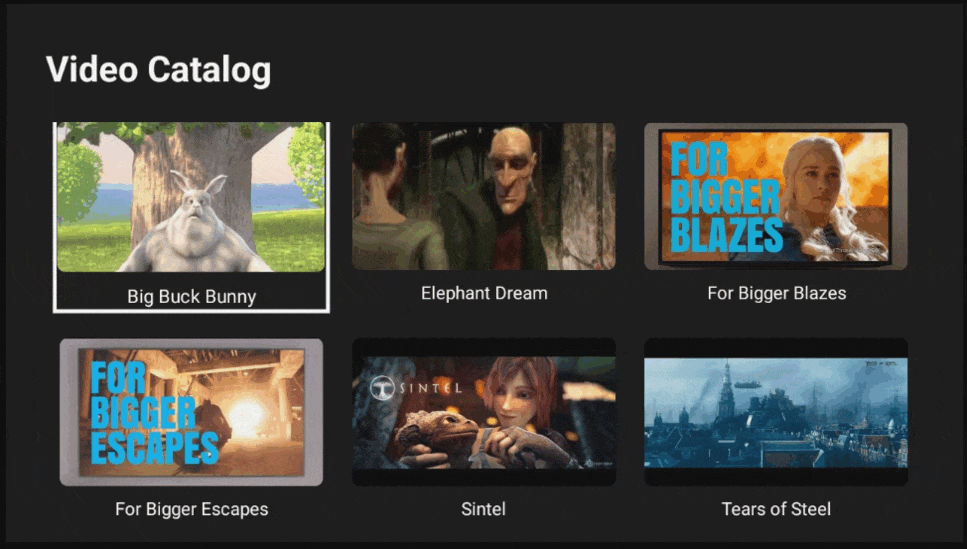

# React Native Android TV OTT Demo

This repository contains a simple Android TV OTT (Over-The-Top) streaming app built with React Native and Expo. The app allows users to browse a video catalog, view details for each video, and play selected videos.

## Technology Stack

- **React Native TVos**: Using the official TV fork of React Native which offers proper focus handling and TV navigation
- **Expo**: For simplified development workflow and TV platform support
- **React Query**: For data fetching, caching, and state management
- **Expo Router**: For navigation between screens
- **React Native Video**: For video playback support

## Features

- Home screen with a grid of video thumbnails
- Details screen showing video information and a play button
- Video player with streaming capabilities
- Loading indicators and error handling
- D-pad navigation optimized for TV remotes
- Unit and integration tests

### Project Structure

```
/app                          # Main application code
  /__tests__                  # Test files
  /details                    # Details screen
  /player                     # Video player screen
  _layout.tsx                 # Root layout with navigation
  index.tsx                   # Home screen
/components                   # Reusable UI components
/data                         # Data and mock catalog
/services                     # API and service functions
/types                        # TypeScript definitions
/utils/formatDuration.ts      # Utility for formatting video duration
```

## Setup and Running the App

### Prerequisites

- Node.js (LTS version)
- Yarn
- Android Studio
- JDK 17
- Android TV emulator or device

### Installation

1. **Clone the repository:**

   ```bash
   git clone git@github.com:prudolfs/react-native-android-tv-ott-demo.git
   cd react-native-android-tv-ott-demo
   ```

2. **Install dependencies:**

   ```bash
   yarn install
   ```

3. **Prepare the Android TV build:**
   ```bash
   yarn prebuild --platform android
   ```

### Running on Android TV Emulator

1. Open Android Studio and start your Android TV emulator
2. Build and run the app:
   yarn android
   The first build may take several minutes as it downloads and configures dependencies. Subsequent builds will be much faster.

### Testing

Run the test suite:
yarn test

## Implementation Notes

### Data Fetching

The app fetches video catalog data from a remote API:
https://gist.github.com/prudolfs/18022863b8fb8ac6c70009e6100e17e2
React Query is used to handle data fetching, caching, and loading states.

### Video Playback

For reliable video playback, the app uses a set of known working video URLs:

```typescript
const reliableVideoUrls = [
  'https://commondatastorage.googleapis.com/gtv-videos-bucket/sample/BigBuckBunny.mp4',
  'https://commondatastorage.googleapis.com/gtv-videos-bucket/sample/ElephantsDream.mp4',
  'https://commondatastorage.googleapis.com/gtv-videos-bucket/sample/ForBiggerBlazes.mp4',
  'https://commondatastorage.googleapis.com/gtv-videos-bucket/sample/ForBiggerEscapes.mp4',
  'https://commondatastorage.googleapis.com/gtv-videos-bucket/sample/Sintel.mp4',
  'https://commondatastorage.googleapis.com/gtv-videos-bucket/sample/TearsOfSteel.mp4',
]
```

### TV-Specific Navigation

The app implements TV-specific focus management for D-pad navigation using React Native's built-in focus handling for TV platforms. Components like Pressable support TV-specific props like hasTVPreferredFocus and the focused state.

## Why Expo with React Native TVos?

I chose to use Expo with React Native TVos because:

1. The React Native core team [officially recommends using Expo](https://github.com/react-native-tvos/react-native-tvos#readme) for new TV projects
2. Expo's development tools provide excellent developer experience with fast refresh
3. The TV fork of React Native offers proper focus engines and TV navigation support
4. Expo's Continuous Native Generation (CNG) model allows for easier integration of native modules

## Known Limitations and TODOs

- Video player controls could be enhanced with custom TV-friendly UI
- Add more comprehensive error handling for network connectivity issues
- Implement caching for video thumbnails to improve performance
- Add support for categories/genres in the video catalog
- Implement user preferences and watch history

---

## License

This project is released under the **MIT License**. See `LICENSE` for details.

---
